[TOC]

# 一般概念

**Safety**：关注“坏事永不发生”（如避免越界、碰撞等）

**Liveness**：强调“好事终将发生”（如任务完成、资源释放）

# 不变集

一个集合 S⊆R^n^ 被称为**不变集**，如果系统从该集合内的任意初始状态出发，其后续的所有状态轨迹始终保持在 *S* 内。数学上可以表示为：x(0)∈S  ⟹  x(t)∈S    ∀ t ≥ 0,这一性质也称为前向不变性（Forward Invariance）

这里 x(t)是系统在时间 t 的状态

### **不变集的类型**

1. **正不变集（Positive Invariant Set）**：
	- 系统从集合 *S* 出发后，状态轨迹始终保持在 S*S* 内（仅关注未来的行为）。
	- **示例**：稳定系统的平衡点周围的某个邻域。
2. **控制不变集（Control Invariant Set）**：
	- 存在一个控制输入序列 *u*(*t*)，使得系统状态始终保持在 *S* 内。
	- **应用**：模型预测控制（MPC）中用于约束状态和输入。
3. **鲁棒不变集（Robust Invariant Set）**：
	- 即使存在外部扰动或模型不确定性，系统状态仍能保持在 *S* 内。
	- **数学条件**：对扰动有界的情况设计集合 *S*。
4. **最大不变集（Maximal Invariant Set）**：
	- 包含所有可能初始状态的最大不变集，通常用于保证闭环系统的稳定性。

若将安全约束定义为集合 S*S*，则不变集可确保系统始终满足安全条件（如状态不越界）

Lyapunov函数 V*(*x*) 的某个水平集（如 V(x)≤c*）通常是一个不变集，用于证明稳定性

在模型预测控制中，不变集用于保证优化问题始终有解（即状态和输入约束可被满足）

- **直观意义**：系统轨迹一旦进入S*S*，未来所有时刻均被约束在S*S*内。

### **数学构造方法**

1. **线性矩阵不等式（LMI）**：
	- 通过求解LMI寻找满足 x^T^Px≤1 的不变集，其中 *P* 是正定矩阵。
2. **可达性分析**：
	- 计算系统从初始状态出发所有可能到达的状态集合，并验证其是否包含于 *S*。
3. **集合迭代法**：
	- 通过递归计算 S~k+1~={x∈S~k~∣Ax∈S~k~}，直到收敛到最大不变集。

### **与吸引域（Region of Attraction）的区别**

- **吸引域**：系统状态最终会收敛到平衡点的初始状态集合。
- **不变集**：系统状态始终保持在集合内，但不一定收敛到某个点（可能包含极限环等）。

# Supperlevel set&安全集

对于函数 f:R^n^→R和标量阈值 α∈R,其 **superlevel set** 定义为：S~α~={x∈R^n^ ∣ f(x)≥α}

对应的 **sublevel set（下水平集）** 则是：S~α~={x∈R^n^ ∣ f(x)≤α}

若将 f(x) 视为系统的性能指标或安全函数，superlevel set 可表示满足性能要求（如能耗足够低）或安全条件（如避障）的状态集合。

不安全集（unsafe set）是指系统状态不应进入或不应保持的状态集合。

安全集C由标量函数*h*(*x*)描述，其形式一般为：C={x∈R^n^∣h(x)≥0}

- 当*h*(*x*)≥0时，状态x被认为是安全的；
- 当*h*(*x*)<0时，状态x违反安全约束。

# Nagumo定理

**通过上下解（upper/lower solutions）和特定条件保证微分方程解的存在性或唯一性**

安全集C是不变集的充要条件为：
在边界∂C上的所有点x，函数h沿系统轨迹的导数h˙(x)非负，即

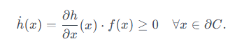

### **屏障证书（Barrier Certificate）详细说明**

屏障证书是一种形式化验证方法，用于确保动态系统的轨迹始终停留在安全区域内，避免进入不安全状态。以下是其核心原理、数学条件、构造方法及应用的全面分析：

---

#### **1. 数学框架与定义**

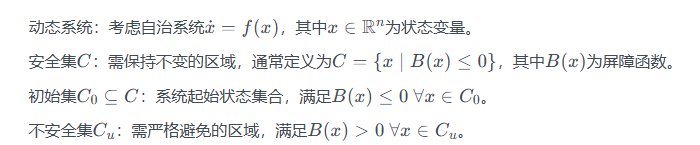

---

#### **2. 屏障函数的核心条件**

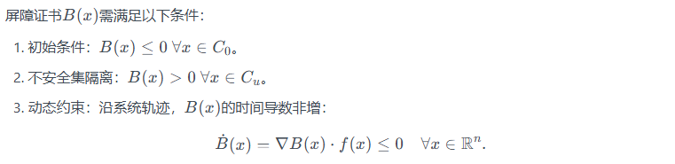

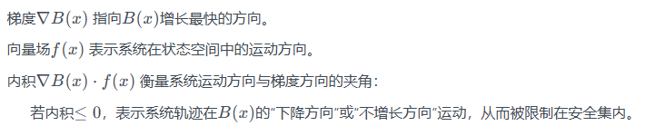

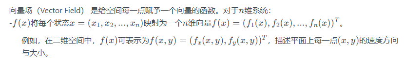

---

#### **3. 安全不变性证明**

若上述条件成立，则安全集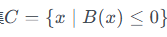是**前向不变集**

Barrier Certificate与Nagumo’s theorem等价，通过选择安全集作为不安全集 C = C~u~^c^ 的补码，其中 B（x） = −h（x），屏障证书条件变为： ̇h_dot（x） ≥ 0

# **Lyapunov 函数的不变层级集（Invariant Level Sets）**

- **Lyapunov 函数V(x)**：通常用于证明系统平衡点的**稳定性**。其性质包括：
	-V(x)>0（正定，除平衡点外），
	-V˙(x)=∇V(x)⋅f(x)≤0（能量递减）。

- 不变层级集

	对于某一常数c>0，集合{x∣V(x)≤c}是不变集,若轨迹初始位于该集合内，则始终停留其中

# **从稳定性到安全性的拓展**

- 安全集包含不变层级集：

	若某个 Lyapunov 层级集{x∣V(x)≤c}被包含在安全集S内（即V(x)≤c  ⟹  x∈S），则：

	- 轨迹在初始时刻进入{x∣V(x)≤c}  ⟹  轨迹始终留在S内。
	- **安全性保证**：通过 Lyapunov 函数的不变性**间接实现**，而非直接依赖屏障条件。

# barrier certificate在closed dynamical systems的扩展

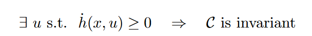

由函数 h 定义安全集 C

### **Viability Theory（生存性理论）的解读**

#### **1. 核心定义与目标**

- Viability Theory（生存性理论）由 Jean-Pierre Aubin 提出，聚焦于 **动态系统在约束条件下的长期演化能力**。其核心问题是：

	> 给定状态约束集K⊆R^n^和系统动力学x_dot=f(x,u)，是否存在控制策略u(t)，使得系统轨迹x(t)始终满足x(t)∈K

	- **生存核（Viability Kernel）**：
		所有初始状态x0∈K的集合，从这些状态出发，存在控制律使轨迹永远停留在K内。
	- **逃逸集（Escape Set）**：
		初始状态x0*x*0​的轨迹必然在有限时间内离开K*K*的区域。

---

#### **2. 数学工具与方法**

1. **微分包含（Differential Inclusion）**：
	将控制问题转化为集合值映射x_dot∈F(x)，其中F(x)={f(x,u)∣u∈U

	- **生存性条件**：在约束集K的边界∂K上，要求F(x)∩T~K~(x)≠∅，其中T~K~(x)是K在x点的切锥。
	- **几何解释**：动力学方向必须至少有一个与约束集边界“相切或指向内部”。

2. **Hamilton-Jacobi 方程**：
	通过求解 PDE 形式的 HJI 方程，计算生存核的边界函数V(x)*V*(*x*)，满足：

	inf⁡ u∈U ∇V(x)⋅f(x,u)≤0 当 V(x)=0 时解V(x)≥0的区域即为生存核。

	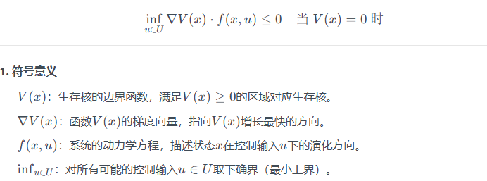

	该条件表示：**在生存核边界V(x)=上，至少存在一个控制输入u∈U，使得系统动力学方向f(x,u)不“指向”生存核外部**。

---

#### **3. 与安全控制的关联**

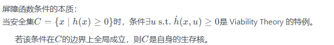

# barrier certificate再扩展

∃ u s.t.  ̇h(x, u) ≥ −α(h(x)) ⇔ C is invariant

α为K函数

# compact sets

在拓扑学中，紧集是满足**“任何开覆盖都有有限子覆盖”**的集合。在**有限维欧几里得空间（如 R^n^）**中，紧集的等价定义为：

- **闭合性**（Closed）：包含所有极限点。
- **有界性**（Bounded）：存在某个半径的球体包含该集合。

例如：闭区间 [0,1] 是紧集，而开区间 (0,1) 或无限区间 [0,∞) 不是紧集。

# 拓扑空间

一个**拓扑空间**由两部分组成：

1. 集合 X: 包含所有需要研究的“点”。
2. 拓扑（Topology）*τ*: 是*X*的子集族（即一组子集），满足以下三条公理：
	- **(T1) 空集和全集属于 *τ***     ∅∈*τ*且*X*∈*τ*.
	- **(T2) 任意开集的并集仍属于 *τ***
		对任意多个开集 {U~α~}⊆*τ*，有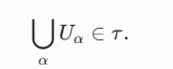
	- **(T3) 有限个开集的交集仍属于 *τ***
		对有限个开集 *U*1,*U*2,…,*U~n~*∈*τ*，有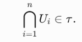

此时，*τ* 中的集合称为**开集**，(*X*,*τ*) 称为一个拓扑空间。

# 开覆盖

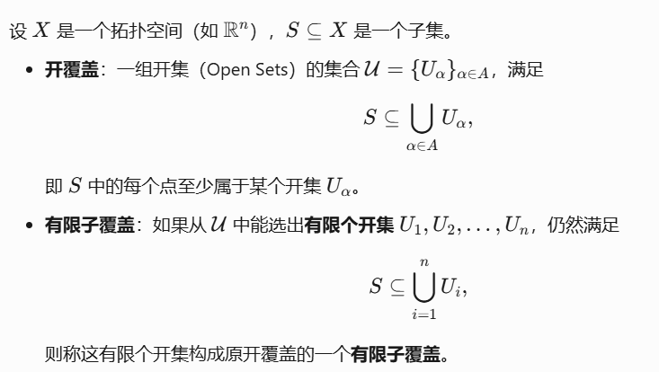

# class K function

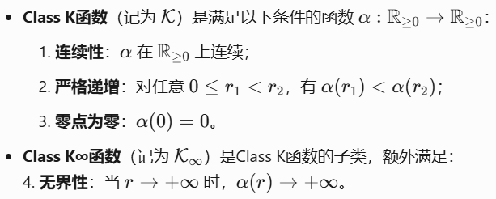

> 基于优化的控制：**将控制问题建模为数学优化问题**，通过求解该问题找到满足约束且最优化性能指标的控制输入

# **非线性仿射控制系统（Nonlinear Affine Control System）**

其特点是控制输入以**线性方式**出现在状态方程中，但系统整体仍是非线性的。

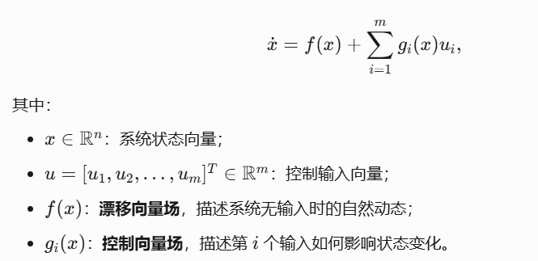

- **输入线性性**：控制输入 *u*~i~ 以**线性组合**的形式作用于状态方程。
- **状态非线性性**：*f*(*x*) 和 *g~i~*(*x*) 可以是关于 *x* 的非线性函数。

>  with f and g locally Lipschitz

#  Lipschitz连续性

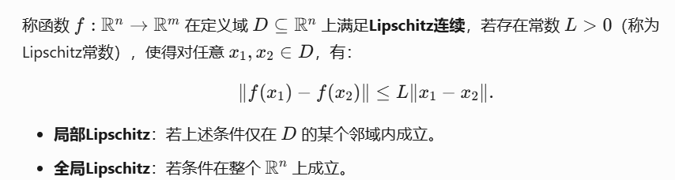

- **动态系统**：微分方程 *x*˙=*f*(*x*,*u*) 的右端函数 *f* 是否Lipschitz连续，决定解的存在唯一性。（Picard-Lindelöf定理））
- **控制器设计**：若反馈控制律 *u*=*k*(*x*) 是Lipschitz连续的，可避免控制输入的剧烈跳变，增强系统鲁棒性。

> **Lipschitz连续 ⇒ 一致连续**

# lyapunov稳定性定理扩展

 *V*__dot_(*x*)≤−*γ*(*V*(*x*))可以取代 *V*_dot(*x*）为负定的要求

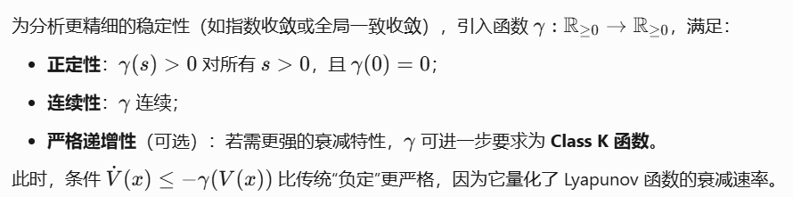

### **李导数（Lie Derivative）**

*f*(*x*) 和 *g*(*x*) 是光滑向量场

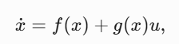

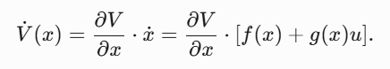

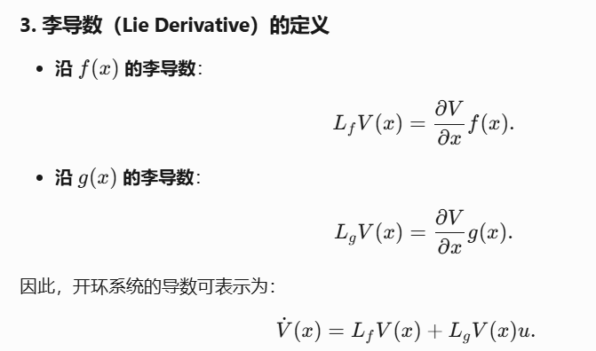

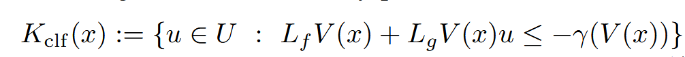

# 向量场

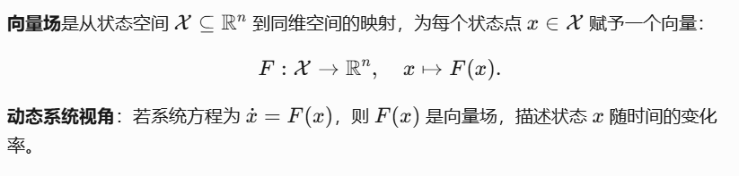

# Picard-Lindelöf定理

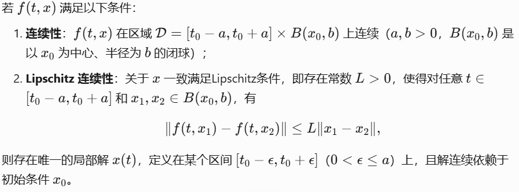

- **存在性**：动态方程在初始时刻附近至少有一个解。
- **唯一性**：解在局部范围内是唯一的，不会分叉或多解。
- **依赖初始条件**：初始值的微小扰动仅导致解的微小变化。

> [*t*0−*a*,*t*0+*a*]×*B*(*x*0,*b*)表示一个 **时间-空间区域**
>
> 时间从 *t*0−*a* 到 *t*0+*a*,以状态 *x*0 为中心，半径为 *b* 的 **闭球**（Closed Ball）

# **前向完备性（Forward Completeness）**

系统在 **所有正向时间 t≥0** 上存在全局解

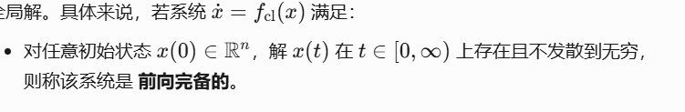

前向完备性保证闭环系统 *x*˙=*f*~cl~(*x*) 的状态不会突然发散，控制器可在无限时间范围内生效。

# **子水平集（Sublevel Set）**

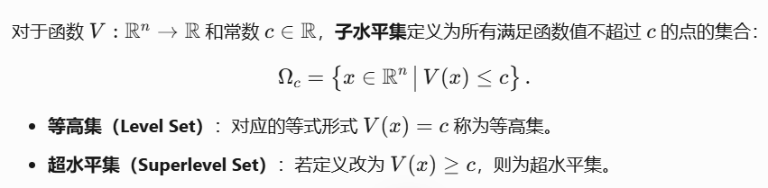

# CBF

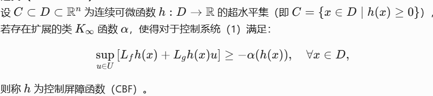

无论当前状态 *x* 如何，总存在至少一个允许的控制输入 *u*∈*U*，使得 *h*(*x*) 的衰减速率（即 *h*˙(*x*)）不低于 −*α*(*h*(*x*))。